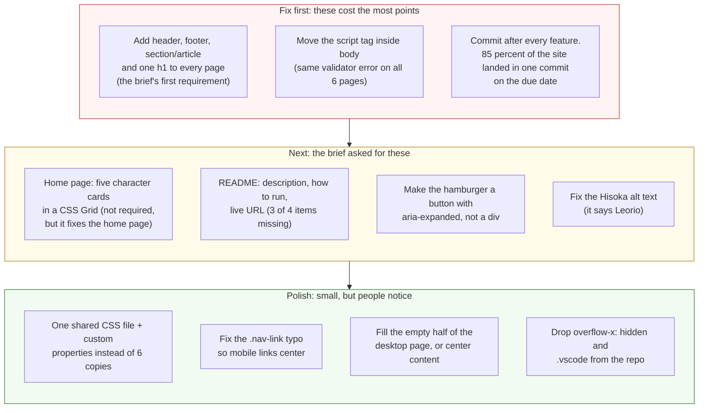

# Project 1: Static Foundations — Feedback

**Student:** Paul Basile · **Repo:** [paul-basile/static-foundations-436](https://github.com/paul-basile/static-foundations-436) · **Live:** [startling-toffee-977910.netlify.app](https://startling-toffee-977910.netlify.app/)
**Reviewed at commit:** `5541740` · **Course:** CSC 436, Fall 2026

> **How this review was made.** Your instructor reviewed this project with [Claude](https://claude.com) (Anthropic's AI) as a second set of eyes. Claude cloned the repo, read every line of all six pages and seven stylesheets, loaded the live site at phone, tablet and desktop widths, ran the W3C validator on every page, and opened and closed the hamburger menu. Every note and every point below was read and approved by your instructor. Same standard, same rubric, just more time spent looking at *your* code than one human has in a grading week.

## Grade: 74 / 100

| Category | Points | Earned | One line |
|---|:-:|:-:|---|
| Semantic HTML | 20 | 12 | Real list nav, titles and alt text everywhere; but only `nav` and `main`, no `h1`, one validator error on every page |
| CSS layout | 25 | 22 | Flexbox is real and well used; six copies of one stylesheet, and a typo that spread to all of them |
| Responsive design | 15 | 13 | No horizontal scroll at any width, hamburger works; desktop-first, one dead rule |
| JavaScript interaction | 15 | 12 | Menu toggle works and is readable; it's a `div`, not a button, and state is tracked by hand |
| Repository and deployment | 15 | 8 | Deploy works; 85% of the site in one commit on the due date; README has 1 of 4 items |
| Content and polish | 10 | 7 | Real writing, real theme, best-optimized images in the class; wrong alt text, empty desktop |
| **Total** | **100** | **74** | **The site has personality. The brief's first requirement was skipped.** |

## The short version

Hunterpedia has a point of view. Each character gets a color world, the sticky nav follows you, the images are small and fast (you're the only student so far whose images are actually optimized), and the writing is yours. That's real.

But the brief's first objective didn't happen. **Semantic structure**: it asked for at least three content sections using semantic elements and one `h1`. Every page has exactly two semantic elements (`nav` and `main`), zero `h1`s, and a heading that jumps from `h2` to `h3`. That one line of the brief is where most of this grade went. The credit you did earn there is for the parts you built well: the list nav, the titles, the alt text. The rest of the deductions are smaller and spread out: six copies of the same stylesheet, a validator error on every page, a thin README, and most of the site in one commit. (No Grid is fine. Flexbox alone satisfies the layout requirement, and yours is genuinely correct.)

## What the numbers looked like

Things Claude measured (so you know these aren't guesses):

| Check | Result |
|---|---|
| Horizontal scroll at 375 / 768 / 900 / 1280 px | None at any width, even with `overflow-x: hidden` turned off |
| Hamburger menu at 375px | Opens, 5 links stack, closes |
| Console errors | 0 |
| W3C HTML validator | 1 error on every page (6 total): `<script>` after `</body>` |
| `h1` elements across 6 pages | 0 |
| Semantic elements per page | `nav`, `main`. No `header`, `section`, `article`, `footer` |
| `display: grid` across 7 CSS files | 0 |
| `display: flex` across 7 CSS files | 42 (7 per theme file) |
| Lines identical between gon-theme.css and killua-theme.css | 140 of 158 |
| Image weight for the whole site | 558 KB across 11 images (excellent) |
| Commits | 4: two on Sep 13, two on Sep 15. The third one is 1,250 lines across 24 files |

---

## Semantic HTML — 12 / 20

**What's working**

- The nav is a real `ul > li > a` ([index.html L22–28](https://github.com/paul-basile/static-foundations-436/blob/5541740/index.html#L22-L28)). `main` wraps the content. Every page has `lang`, a viewport tag, and its own `<title>` ("Hunterpedia: Gon"). Every image has an `alt`.
- Using a real CSS reset (the-new-css-reset, credited in the file) is a mature choice.

**What to change**

- **No `h1`, anywhere.** The logo is an `h2` ([L15](https://github.com/paul-basile/static-foundations-436/blob/5541740/index.html#L15)) and "Welcome to Hunterpedia!" is an `h3` ([L32](https://github.com/paul-basile/static-foundations-436/blob/5541740/index.html#L32)), so every page's outline starts at level 2 and skips to 3. The validator flags it on all six pages. The site title in the nav shouldn't be a heading at all (a `span` or just the link text). The page's actual title should be the `h1`: "Welcome to Hunterpedia!" on the home page, "Gon Freecss" on Gon's page.
- **Two semantic elements per page.** The brief asked for at least three distinct content sections using `header`, `nav`, `main`, `section`, `article`, `footer`. You have `nav` and `main`. Everything else is a `div`: `div.container` ([L12](https://github.com/paul-basile/static-foundations-436/blob/5541740/index.html#L12)), `div.logo`, `div.dropdown`, `div.content-container`. The nav belongs inside a `header`. The character pages are a natural `article`. A `footer` with a credit line takes one minute. None of your CSS needs to change; the class names stay.

  ```mermaid
  flowchart TB
      subgraph now["Now: every page, index.html lines 12 to 38"]
          direction TB
          a1["div.container"] --> a2["nav.navbar"]
          a2 --> a3["div.logo > a > <b>h2</b>"]
          a2 --> a4["div.dropdown (3 bars)"]
          a2 --> a5["ul.nav-links"]
          a1 --> a6["main.site"]
          a6 --> a7["div.content-container"]
          a7 --> a8["<b>h3</b> Welcome"]
          a7 --> a9["p, img"]
          a1 -.- a10["(no header, no footer,<br/>no section, no article,<br/>no h1 anywhere)"]
      end
      subgraph next["What the brief asks for: 3+ semantic sections, one h1"]
          direction TB
          b1["body"] --> b2["<b>header</b>"]
          b2 --> b3["a.logo > span (not a heading)"]
          b2 --> b4["nav > <b>button</b>.dropdown + ul"]
          b1 --> b5["<b>main</b>"]
          b5 --> b6["<b>h1</b> Welcome to Hunterpedia"]
          b5 --> b7["<b>section</b> intro: p, img"]
          b5 --> b8["<b>section</b> characters:<br/>5 article cards in a Grid"]
          b1 --> b9["<b>footer</b>"]
      end
      now ==>|"same content, same CSS hooks,<br/>real structure"| next
      style a1 fill:#fde2e2,stroke:#c0392b,color:#111
      style a3 fill:#fde2e2,stroke:#c0392b,color:#111
      style a4 fill:#fde2e2,stroke:#c0392b,color:#111
      style a8 fill:#fde2e2,stroke:#c0392b,color:#111
      style a10 fill:#fff4d6,stroke:#b7791f,color:#111,stroke-dasharray: 5 5
      style b2 fill:#e3f4e1,stroke:#2e7d32,color:#111
      style b5 fill:#e3f4e1,stroke:#2e7d32,color:#111
      style b6 fill:#e3f4e1,stroke:#2e7d32,color:#111
      style b7 fill:#e3f4e1,stroke:#2e7d32,color:#111
      style b8 fill:#e3f4e1,stroke:#2e7d32,color:#111
      style b9 fill:#e3f4e1,stroke:#2e7d32,color:#111
  ```

- **The `<script>` tag is outside `<body>`** ([L41](https://github.com/paul-basile/static-foundations-436/blob/5541740/index.html#L41)), on all six pages. Browsers forgive it, the validator doesn't, and it's the one error that shows up six times. Move it to just before `</body>`.
- **The hamburger is a `div`** ([L17–21](https://github.com/paul-basile/static-foundations-436/blob/5541740/index.html#L17-L21)). A keyboard user can't reach it, a screen reader doesn't know it's clickable. It should be a `<button aria-label="Menu" aria-expanded="false">`. The three bars can stay as `span`s inside it.
- **Hisoka's alt text is Leorio's.** [page5-hisoka.html L32–33](https://github.com/paul-basile/static-foundations-436/blob/5541740/page5-hisoka.html#L32-L33) says `alt="Locked In"` and `alt="Leorio Paradinight"` on two pictures of Hisoka. Copy-paste left a trail. And "MY GOAT KURAPIKA" ([page3-kurapika.html L33](https://github.com/paul-basile/static-foundations-436/blob/5541740/page3-kurapika.html#L33)) is funny but alt text is for describing the image to someone who can't see it.

## CSS layout — 22 / 25

**What's working**

- **Flexbox is doing real, correct work.** The nav is `justify-content: space-between` with a flex logo group ([home-theme.css L6–18](https://github.com/paul-basile/static-foundations-436/blob/5541740/assets/css/home-theme.css#L6-L18)), `main` is a centered column, `.img-container` is a row that becomes a column on phones ([gon-theme.css L83–86](https://github.com/paul-basile/static-foundations-436/blob/5541740/assets/css/gon-theme.css#L83-L86), [L152–155](https://github.com/paul-basile/static-foundations-436/blob/5541740/assets/css/gon-theme.css#L152-L155)). `flex-basis: 100%` to force the mobile menu onto its own line is exactly the right tool. You understand Flexbox.
- The per-character theming (background gradient, nav gradient, card colors, border color) is consistent and deliberate. The `scale` hover on images with a transition ([L94–99](https://github.com/paul-basile/static-foundations-436/blob/5541740/assets/css/gon-theme.css#L94-L99)) is a nice touch. `position: sticky` on the nav with `z-index` is correct.

**What to change**

- **No Grid, and that's fine.** Flexbox or Grid satisfies the layout requirement, and your Flexbox does. But the home page is begging for a Grid anyway, so consider this a suggestion, not a deduction. Right now it says "check out the top right to view" instead of showing the characters. Replace that sentence with five character cards in a `display: grid; grid-template-columns: repeat(auto-fit, minmax(180px, 1fr))`, each card an `article` with the character's image and name linking to their page. That's Grid doing real work, a better home page, and a semantic section, all in one change.
- **Six copies of the same stylesheet.** gon-theme.css and killua-theme.css share 140 of 158 lines verbatim. Six files, 929 lines, and only the colors differ. The proof it's a problem: there is a typo, `.nav-link a` instead of `.nav-links a` ([gon-theme.css L125](https://github.com/paul-basile/static-foundations-436/blob/5541740/assets/css/gon-theme.css#L125)), and because it was copied, it's now wrong in six files. That rule never applies, so your mobile menu links are never centered or enlarged like you intended. The fix is custom properties: one `site.css` with all the layout, and a tiny per-page file that only sets `--bg`, `--nav`, `--accent` on `body`.

  ```mermaid
  flowchart TB
      subgraph now["Now: 6 theme files, 929 lines, 140 of every 158 identical"]
          direction LR
          f1["home-theme.css<br/>120 lines"]
          f2["gon-theme.css<br/>158 lines"]
          f3["killua-theme.css<br/>160 lines"]
          f4["kurapika-theme.css<br/>165 lines"]
          f5["leorio-theme.css<br/>163 lines"]
          f6["hisoka-theme.css<br/>163 lines"]
          f1 ~~~ f2 ~~~ f3 ~~~ f4 ~~~ f5 ~~~ f6
      end
      bug["One typo (.nav-link a instead of .nav-links a)<br/>is now wrong in 6 places.<br/>Every future fix: 6 edits."]
      subgraph next["Better: one layout file, one tiny theme per page"]
          direction TB
          s1["site.css: nav, main, dropdown,<br/>media query. ~150 lines, written once."]
          s2["gon.css: 8 lines<br/>body { --bg: #35;1f421f; --accent: #35;b2eb63; ... }"]
          s3["killua.css: 8 lines<br/>body { --bg: #35;345a6e; --accent: #35;4e8fd4; ... }"]
          s4["...one per character"]
          s1 --> s2 & s3 & s4
      end
      now --> bug ==>|"custom properties are the fix"| next
      style f1 fill:#fff4d6,stroke:#b7791f,color:#111
      style f2 fill:#fff4d6,stroke:#b7791f,color:#111
      style f3 fill:#fff4d6,stroke:#b7791f,color:#111
      style f4 fill:#fff4d6,stroke:#b7791f,color:#111
      style f5 fill:#fff4d6,stroke:#b7791f,color:#111
      style f6 fill:#fff4d6,stroke:#b7791f,color:#111
      style bug fill:#fde2e2,stroke:#c0392b,color:#111
      style s1 fill:#e3f4e1,stroke:#2e7d32,color:#111
      style s2 fill:#e3f4e1,stroke:#2e7d32,color:#111
      style s3 fill:#e3f4e1,stroke:#2e7d32,color:#111
      style s4 fill:#e3f4e1,stroke:#2e7d32,color:#111
  ```

- **`overflow-x: hidden` on `body`** ([L3](https://github.com/paul-basile/static-foundations-436/blob/5541740/assets/css/home-theme.css#L3)) hides horizontal overflow instead of fixing it. Claude turned it off and measured: nothing overflows, so you don't need it. Delete it. If something ever does overflow, you want to see it.
- Small: `transition: all` ([L38](https://github.com/paul-basile/static-foundations-436/blob/5541740/assets/css/home-theme.css#L38)) animates every property. Name the one you mean (`background-color`). Two semicolons on [gon-theme.css L80](https://github.com/paul-basile/static-foundations-436/blob/5541740/assets/css/gon-theme.css#L80).

## Responsive design — 13 / 15

**What's working**

- No horizontal scroll at 375, 768, 900 or 1280. Images go side-by-side on desktop and stack on phones. The nav collapses to a hamburger under 768px and the links stack full-width. The site is genuinely usable on a phone.

**What to change**

- **Desktop-first.** The brief asked for mobile-first. Your base styles are the desktop and `@media (max-width: 768px)` undoes them. Flip it: phone styles as the default, `@media (min-width: 769px)` adds the row layout and the inline nav.
- The dead `.nav-link a` rule (see CSS) means the mobile menu you designed (centered, 28px) is not the one that ships. Fix the typo and look at it again on a phone.
- On desktop the content fills the top third of the screen and the bottom two thirds is gradient. Not a responsive bug, but see Polish.

## JavaScript interaction — 12 / 15

**What's working**

- The menu toggle does what the brief asks: selects elements, listens for a click, changes the page. It works, Claude clicked it. Zero console errors. The code is short and readable ([nav.js](https://github.com/paul-basile/static-foundations-436/blob/5541740/assets/js/nav.js)).

**What to change**

- **Tracking state by hand.** `menuOpen` is a copy of something the DOM already knows. Two ways to do this in one line: `navLinks.classList.toggle('open')` with a `.nav-links.open { display: block }` rule, or `navLinks.hidden = !navLinks.hidden`. Either one removes the boolean, the `if/else if`, and the inline style.
- **The inline style sticks.** `navLinks.style.display = "block"` ([L7](https://github.com/paul-basile/static-foundations-436/blob/5541740/assets/js/nav.js#L7)) writes an inline style that outranks your stylesheet. Open the menu on a phone, rotate to landscape or widen the window, and the desktop nav is now `display: block` instead of `flex`: the links stack vertically on desktop. A class toggle doesn't have this problem because the media query still wins.
- The toggle target is a `div`, so this interaction only works with a mouse or a finger. Make it a `button` (see HTML) and set `aria-expanded` in the handler.
- `if (menuOpen == false) ... else if (menuOpen == true)`: a boolean only has two values, so the second check is always true when reached. `if (menuOpen) {...} else {...}`.

## Repository and deployment — 8 / 15

**What's working**

- Live URL works in a private window and matches the repo (the only differences are Netlify rewriting `.html` links, which is Netlify's doing, not yours). Pages load at clean URLs.

**What to change**

- **The history.** Four commits: an initial commit and a skeleton on September 13, then "Finished base website." on September 15 with 1,250 lines across 24 files, then a one-line fix. About 85% of the project is in one commit on the due date. It's not the single-commit case the brief warns about, but it's close, and it means the log can't show the site developing. Commit after each page, after the nav, after the media query. Aim for 10 to 20 commits on Project 2.
- **README has one of four required items.** Title, yes. Description, how to run locally, live URL: missing. "Project 1 for CSC 436." isn't a description.
- Commit messages: the brief asked for present tense, "add nav", "fix card layout". Yours are sentences with periods ("Finished base website.", "Oops, forgot to tweak Gon's mobile theme"). Small habit, but it's the industry one.
- `.vscode/settings.json` is your editor's config, not the project's. Add it to your global gitignore.

## Content and polish — 7 / 10

**What's working**

- **The images are the best-optimized in the class.** WebP, 558 KB for eleven images, nothing over 200 KB. Most students shipped multi-megabyte photos. You didn't.
- Real writing with a voice ("who so happens to want NOTHING to do with him"), a real theme, a color identity per character, per-page titles. It reads like a fan made it, which is the point.

**What to change**

- **Wrong alt text on the Hisoka page** (see HTML). That's a copy-paste error a screen reader user would hear.
- **The desktop layout stops at the top third.** On a 1280×1500 screen, the content ends around 650px and the rest is gradient. Either center the content vertically (`main { min-height: 100vh; justify-content: center }`, you already have the flex column) or give the page more to do. The character-card grid on the home page is the natural fix.
- The home page tells people to "check out the top right" instead of linking to the characters. Never describe the UI; show it.
- No footer. One line with a credit and a "Hunter x Hunter is by Yoshihiro Togashi" note finishes the page.

---

## Your next three moves



1. **Build the character grid on the home page.** Five `article` cards in a CSS Grid, each linking to a character page. This one change gives you a `section`, a home page that actually works, and your first Grid. Two hours.
2. **Fix the skeleton on every page.** `header` around the nav, `h1` for the page title, `footer` at the bottom, script tag inside `body`. Thirty minutes for six pages, and it clears every validator error.
3. **Read the brief before Project 2 and make a checklist.** The first objective was missed here, and it was stated in bold. The site you built shows you can do the work. The checklist makes sure you do the *assigned* work.

You made something with a personality, and that's harder to teach than Grid. Now go back and hit the requirements.

*This PR only adds feedback files. It does not touch your code. Merge it, close it, or just read it, your call. Questions go to office hours or the Brightspace board.*
