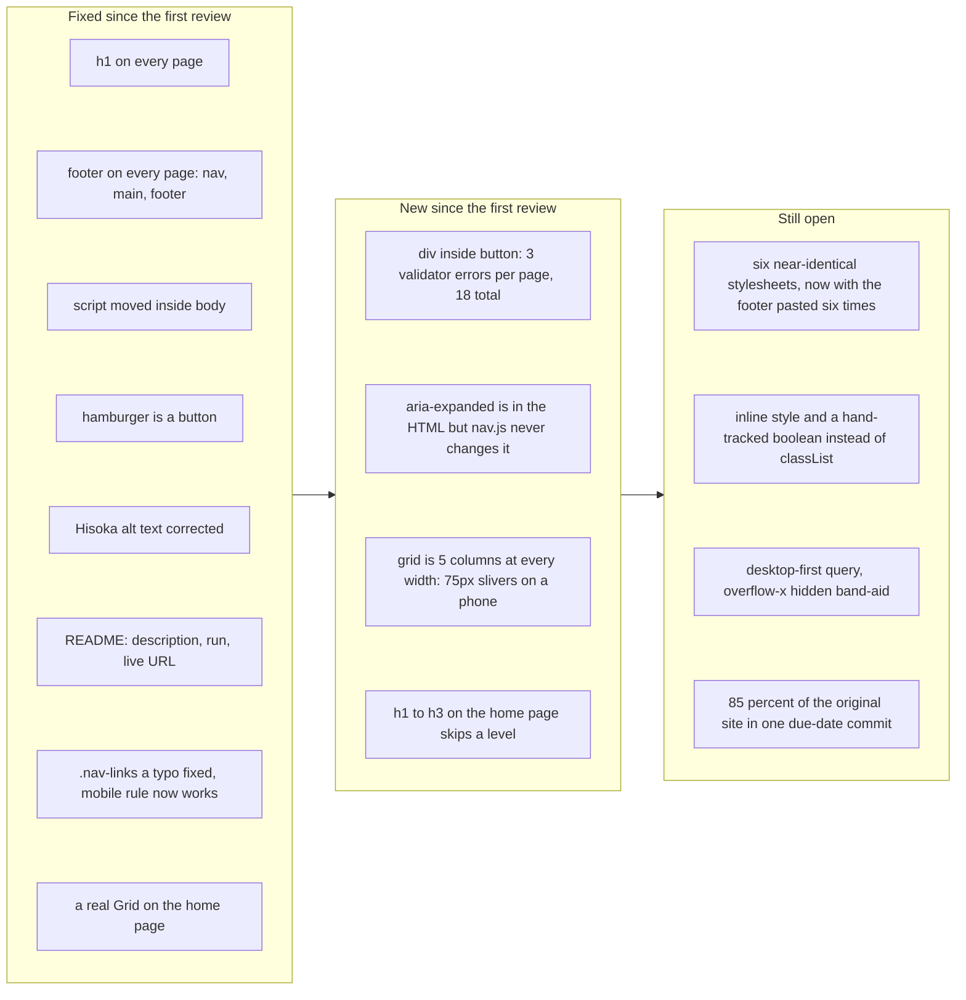

# Project 1: Static Foundations. Resubmission review for Paul Basile

**Student:** Paul Basile · **Course:** CSC 436, Fall 2026 · **First review at:** [`5541740`](https://github.com/paul-basile/static-foundations-436/commit/55417400de9fa3f2f8dc517061f2370dee354282) (74 / 100) · **This review at:** [`d7d9785`](https://github.com/paul-basile/static-foundations-436/commit/d7d9785fbb88550cf4cff081f5339da6b241650c)
**Repo:** https://github.com/paul-basile/static-foundations-436 · **Live:** https://startling-toffee-977910.netlify.app/

> **How this review was made.** Same as the first one. Your instructor reviewed the resubmission with Claude (Anthropic's AI) as a second set of eyes. Claude pulled the five new commits, diffed every file against the graded commit, re-ran the W3C validator on all six pages, loaded the live site at phone, tablet and desktop widths, clicked the hamburger and read its `aria-expanded` before and after, and measured the new image grid at 375 and 1280. Every note and every point below was read and approved by your instructor. The original review is unchanged in [FEEDBACK.md](FEEDBACK.md); this file is only about what changed.

## Grade: 84 / 100 (was 74)

| Category | Points | Was | Now | What moved it |
|---|---|---|---|---|
| Semantic HTML | 20 | 12 | **15** | +h1 everywhere, +footer everywhere, +script in body, +button, +alt fixed. −18 new validator errors (`div` inside `button`), −h1 to h3 skip on the home page |
| CSS layout | 25 | 22 | **23** | +typo fixed. Grid added. Six duplicate stylesheets remain, and the footer was pasted into all six |
| Responsive design | 15 | 13 | **13** | +the dead mobile rule now works. −the new grid is five columns at every width |
| JavaScript interaction | 15 | 12 | **13** | +real button. `aria-expanded` was added to the HTML but the script never updates it |
| Repository and deployment | 15 | 8 | **11** | +README now has all four items. The five new commits are well described. The original due-date dump is still the history |
| Content and polish | 10 | 7 | **9** | +alt text right, +footer, +desktop no longer empty. −the grid is five decorative squares that link nowhere |
| **Total** | **100** | **74** | **84** | Ten points, earned by fixing exactly what the first review listed. The new deductions are all one-line fixes. |

## The short version

You fixed what was on the list, and you did it in five commits with messages that say what changed. Every page has an `h1`. Every page has a `footer`, so every page now has three semantic sections, which was the brief's first requirement and the biggest deduction last time. The script is inside `body`. The hamburger is a `<button>`. Hisoka's alt text is Hisoka's. The README has a description, run instructions and the live link. The `.nav-links a` typo is gone, which also brought the dead mobile rule back to life. And there is a Grid on the home page now, which the first review suggested and did not require.

Three things came in with the fixes. The button holds three `<div>`s, which is not allowed, so every page went from one validator error to three. The `aria-expanded` attribute is on the button, but nothing in `nav.js` changes it, so it says `false` whether the menu is open or closed. And the grid is `repeat(5, 1fr)` with no media rule, so on a phone the five character portraits are 75 px slivers. All three are small, and they are the difference between 84 and the high 80s.

## What the numbers looked like

| Check | First review | Now |
|---|---|---|
| `h1` across 6 pages | 0 | 6 (one per page) |
| Semantic elements per page | `nav`, `main` | `nav`, `main`, `footer` |
| W3C errors across 6 pages | 6 (script after body) | 19 (`div` in `button` ×18, heading skip ×1) |
| Hamburger element | `div` | `button` with `aria-expanded` |
| `aria-expanded` after clicking open | n/a | still `"false"` |
| `display: grid` | 0 | 1 (home page, 5 columns) |
| Grid columns at 375 / 768 / 1280 | n/a | 5 / 5 / 5 |
| Grid cell width at 375 | n/a | 75 px |
| README items (title, description, run, live URL) | 1 of 4 | 4 of 4 |
| Hisoka alt text | "Locked In", "Leorio Paradinight" | "Hisoka Morow", "The formidable one." |
| Horizontal scroll at 375 / 768 / 1280 | None | None |
| Console errors | 0 | 0 |
| Desktop home page at 1280 by 900 | Content ends at 650 px | Grid fills to 713 px, footer below |
| Commits | 4 | 9 (5 new on Sep 16, each with a real message) |
| Live vs repo | Identical | Identical apart from Netlify rewriting `.html` links |

---

## What was fixed, and what it earned

- **`h1` on every page** ([index.html#L15](https://github.com/paul-basile/static-foundations-436/blob/d7d9785fbb88550cf4cff081f5339da6b241650c/index.html#L15)). The logo went from `h2` to `h1`. Every page now has exactly one. That was the single largest note in the first review.
- **`footer` on every page** ([index.html#L47-L49](https://github.com/paul-basile/static-foundations-436/blob/d7d9785fbb88550cf4cff081f5339da6b241650c/index.html#L47-L49), [page1-gon.html#L45-L47](https://github.com/paul-basile/static-foundations-436/blob/d7d9785fbb88550cf4cff081f5339da6b241650c/page1-gon.html#L45-L47)). `nav`, `main`, `footer`: three semantic sections, which is what the brief asked for. Your reasoning about `header` is fine; the nav is your header. `footer` was the right pick.
- **Script inside `body`** ([index.html#L51](https://github.com/paul-basile/static-foundations-436/blob/d7d9785fbb88550cf4cff081f5339da6b241650c/index.html#L51)). The one validator error from last time is gone from all six pages.
- **The hamburger is a `<button>`** ([index.html#L17](https://github.com/paul-basile/static-foundations-436/blob/d7d9785fbb88550cf4cff081f5339da6b241650c/index.html#L17)). Keyboard users can reach it now. See below for the part that is not finished.
- **Hisoka's alt text** ([page5-hisoka.html#L32-L33](https://github.com/paul-basile/static-foundations-436/blob/d7d9785fbb88550cf4cff081f5339da6b241650c/page5-hisoka.html#L32-L33)). Correct.
- **README** ([README.md](https://github.com/paul-basile/static-foundations-436/blob/d7d9785fbb88550cf4cff081f5339da6b241650c/README.md)). Description, how to run, live link. All four items. The `git clone {repo url}` placeholder should be the real URL, but the item counts.
- **The typo** ([home-theme.css#L114](https://github.com/paul-basile/static-foundations-436/blob/d7d9785fbb88550cf4cff081f5339da6b241650c/assets/css/home-theme.css#L114) and the other five). `.nav-link a` is now `.nav-links a` inside the media query, so the phone nav rule that did nothing last time now applies.
- **A Grid** ([home-theme.css#L16-L34](https://github.com/paul-basile/static-foundations-436/blob/d7d9785fbb88550cf4cff081f5339da6b241650c/assets/css/home-theme.css#L16-L34)). `repeat(5, 1fr)` with five background-image cells. The first review said the home page was begging for one. It looks good on a desktop.

## What came in with the fixes

- **Three `<div>`s inside a `<button>`** ([index.html#L17-L21](https://github.com/paul-basile/static-foundations-436/blob/d7d9785fbb88550cf4cff081f5339da6b241650c/index.html#L17-L21)). A button may only contain phrasing content, and `div` is not phrasing. The validator now reports three errors on every page, 18 in total, where it reported one before. The fix is three characters: change each `<div class="bar">` to `<span class="bar">` and add `display: block` to `.bar` in the CSS. Same look, zero errors. Also give the button an `aria-label="Menu"`, because it has no text.
- **`aria-expanded` never changes** ([index.html#L17](https://github.com/paul-basile/static-foundations-436/blob/d7d9785fbb88550cf4cff081f5339da6b241650c/index.html#L17), [nav.js#L5-L14](https://github.com/paul-basile/static-foundations-436/blob/d7d9785fbb88550cf4cff081f5339da6b241650c/assets/js/nav.js#L5-L14)). The attribute is there, which is the right instinct, but the script only touches `style.display` and `menuOpen`. Claude clicked the button open and read the attribute: still `"false"`. So a screen reader announces "collapsed" while the menu is open. This is the same fix the first review suggested for the boolean, and it solves both at once:

  ```js
  dropdown.addEventListener('click', () => {
    const open = navLinks.classList.toggle('open');
    dropdown.setAttribute('aria-expanded', open);
  });
  ```

  with `.nav-links.open { display: block; }` in the phone media query. No inline style, no `menuOpen`, and the attribute tells the truth.

  ```mermaid
  flowchart TB
    A["User taps the hamburger"] --> B["nav.js click handler"]
    B --> C["Today: navLinks.style.display flips, menuOpen flips"]
    C --> D["aria-expanded stays false forever. A screen reader hears: button, collapsed. Even when it is open."]
    B --> E["Fix: const open = navLinks.classList.toggle('open')"]
    E --> F["dropdown.setAttribute('aria-expanded', open)"]
    F --> G["CSS: .nav-links.open { display: block }. No inline style, no boolean, and the attribute tells the truth."]
  ```

- **The grid does not adapt** ([home-theme.css#L16-L22](https://github.com/paul-basile/static-foundations-436/blob/d7d9785fbb88550cf4cff081f5339da6b241650c/assets/css/home-theme.css#L16-L22)). Five columns at 1280 is right. Five columns at 375 gives each portrait 75 px, and `background-size: cover` crops each face to a strip. Two options: `repeat(auto-fit, minmax(160px, 1fr))` and it goes 5, 4, 2 on its own; or add `.image-grid { grid-template-columns: repeat(2, 1fr) }` inside the existing 768 px query. Either is one line.
- **The grid cells are empty `<div>`s with background images** ([index.html#L39-L45](https://github.com/paul-basile/static-foundations-436/blob/d7d9785fbb88550cf4cff081f5339da6b241650c/index.html#L39-L45)). A screen reader gets nothing, and clicking a face does nothing, which is the first thing a visitor will try. Make each cell an `<a href="/page1-gon.html">` with an `` inside, and the grid becomes the site's navigation instead of decoration. Then add `h2` headings to the character pages (they have only the `h1` logo) and change the home `h3` to `h2` so the outline does not skip a level ([index.html#L33](https://github.com/paul-basile/static-foundations-436/blob/d7d9785fbb88550cf4cff081f5339da6b241650c/index.html#L33)).

## What is still open from the first review

- **Six copies of the stylesheet.** The resubmission is the proof: the footer rule was added to all six files, thirteen lines times six ([gon-theme.css](https://github.com/paul-basile/static-foundations-436/blob/d7d9785fbb88550cf4cff081f5339da6b241650c/assets/css/gon-theme.css), [killua-theme.css](https://github.com/paul-basile/static-foundations-436/blob/d7d9785fbb88550cf4cff081f5339da6b241650c/assets/css/killua-theme.css) and so on). One `base.css` with the shared 140 lines, plus a 20-line theme file per character, and the next fix is one edit instead of six.
- **Desktop-first, and `overflow-x: hidden`** ([home-theme.css#L3](https://github.com/paul-basile/static-foundations-436/blob/d7d9785fbb88550cf4cff081f5339da6b241650c/assets/css/home-theme.css#L3)). Unchanged from the first review. Neither costs much, and neither is urgent.
- **The history.** The five new commits are what the brief asked for: "Added footer to each page with a link to my github," "Fixed .nav-links a selector typo and put script into the body." That is the habit. It arrived after the deadline, so the original single-commit deduction stays, but it is smaller than it was because the repo now shows you can do it.



## If you touch it once more

1. **`span` instead of `div` in the button, plus `aria-label="Menu"`.** Eighteen validator errors to zero. Five minutes.
2. **Wire `aria-expanded` with `classList.toggle`.** Four lines of JS, one line of CSS. It fixes the attribute and retires the boolean and the inline style in the same move.
3. **Make the grid adapt and make it clickable.** `auto-fit` with `minmax`, and a link with an image in each cell.

*This file lives alongside the original review in the same pull request. Nothing in your code is modified. Nice work on the turnaround, Paul. The list was long and you went through it.*
